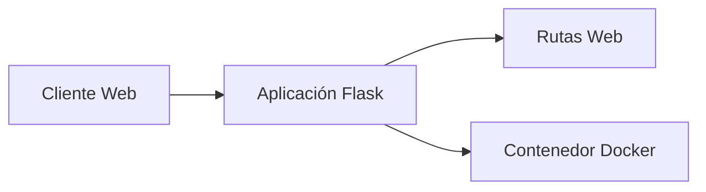

# Student Contribution

## Developer Information

- Name: Jennifer Ailín Medina Hernández
- University: Universidad Tecnológica del Norte de Guanajuato
- Date: Junio 2026

## Proposed Improvements

1. Mejorar la documentación para nuevos colaboradores.
2. Agregar ejemplos de despliegue en distintos entornos.
3. Incluir diagramas y guías de desarrollo.

## Observations

Este proyecto es una aplicación web sencilla desarrollada con Flask. Su estructura minimalista facilita el aprendizaje de conceptos básicos de desarrollo web y contenedores Docker.

## Project Strengths

1. Estructura simple y fácil de comprender.
2. Implementación ligera y de rápida ejecución.
3. Incluye soporte para Docker.
4. Es ideal para fines educativos y de aprendizaje.
5. Facilita la comprensión de los fundamentos de Flask.

## Improvement Opportunities

1. Incorporar pruebas unitarias automatizadas.
2. Agregar documentación técnica más detallada.
3. Implementar manejo de errores más robusto.
4. Añadir integración continua (CI/CD).
5. Incluir una guía de contribución para desarrolladores.

## Technologies Used

| Tecnología | Propósito                             |
| ---------- | ------------------------------------- |
| Python     | Lenguaje de programación principal    |
| Flask      | Framework web                         |
| Docker     | Contenerización de la aplicación      |
| Git        | Control de versiones                  |
| GitHub     | Colaboración y alojamiento del código |
| Ubuntu     | Sistema operativo base                |

## System Architecture



## Functional Requirements

RF-01 El sistema deberá mostrar un mensaje de bienvenida en la página principal.

RF-02 El sistema deberá proporcionar una ruta adicional para interacción con el usuario.

RF-03 El sistema deberá responder a solicitudes HTTP GET.

RF-04 El sistema deberá ejecutarse mediante el framework Flask.

RF-05 El sistema deberá poder desplegarse utilizando Docker.

RF-06 El sistema deberá exponer el servicio mediante el puerto 5000.

RF-07 El sistema deberá permitir el acceso desde un navegador web.

RF-08 El sistema deberá generar respuestas de texto para las rutas configuradas.

RF-09 El sistema deberá ejecutarse en entornos Linux compatibles.

RF-10 El sistema deberá permitir futuras extensiones funcionales.

## Team Members

- Jennifer Ailín Medina Hernández


# Evidencias de la Práctica 03

## Evidencia 1. Fork creado

Se realizó correctamente el Fork del repositorio original hacia mi cuenta personal de GitHub.

**Captura:**


---

## Evidencia 2. Configuración del repositorio remoto

Se configuró correctamente el repositorio original como upstream y se verificó mediante el comando:

```bash
git remote -v
```

**Captura:**


---

## Evidencia 3. Creación de la rama de desarrollo

Se creó la rama de trabajo `dev` para realizar las modificaciones solicitadas.

Comando utilizado:

```bash
git branch
```

**Captura:**


---

## Evidencia 4. Registro de cambios mediante commit

Se registraron los cambios realizados en el archivo README.md mediante un commit.

Comando utilizado:

```bash
git log --oneline
```

**Captura:**


---

## Evidencia 5. Pull Request creado

Se generó correctamente un Pull Request desde la rama `dev` de mi Fork hacia la rama principal del repositorio original.

**Captura:**


---

## Evidencia 6. URL del Pull Request

URL del Pull Request generado:

```text
https://github.com/Jen031205/simple-webapp-flask/pull/1
